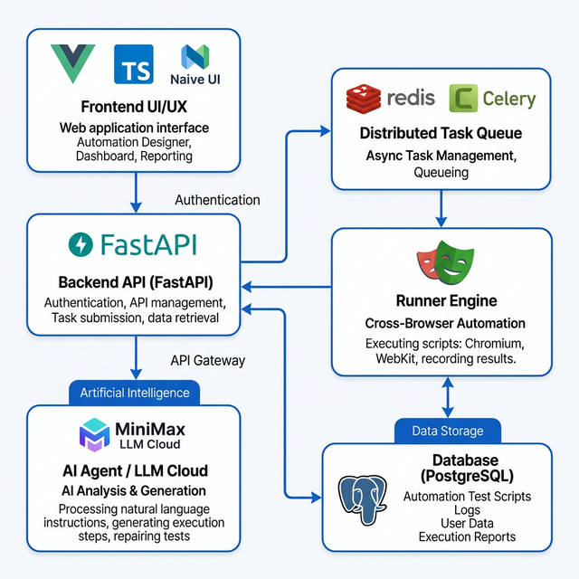

# 智能 UI 自动化测试平台 (Intelligent UI Automation Platform)

基于 Python (FastAPI) 和 Vue 3 构建的现代化、企业级 UI 自动化测试平台。它利用 Playwright 实现强大的浏览器自动化，并集成了 AI 能力以简化测试用例的创建。

## 🏗 架构设计图

(./assets/mermaid-diagram-01.png)

## ✨ 核心功能

### 🚀 核心自动化能力
-   **Page Object Model (POM)**: 结构化管理页面和 UI 元素，确保测试的可维护性。
-   **多浏览器支持**: 无缝支持 Chromium, Firefox, 和 WebKit (通过 Playwright)。
-   **分布式执行**: 使用 Celery 和 Redis 实现异步测试执行。
-   **"Injection + Proxy" (注入 + 代理)** 模式，确保前端执行的灵活性与后端密钥的安全性。

### 🤖 Page-Agent 智能集成 (New!)
本项目深度集成了 [Alibaba Page-Agent](https://github.com/alibaba/page-agent)，实现了基于自然语言的智能操作执行与自我修复能力。


#### 核心能力
1.  **Agent-First Execution (智能优先执行)**
    *   AI 生成的测试步骤如果难以用传统选择器描述，将标记为 `AI_AUTO`。
    *   执行引擎直接调用 Page-Agent，将自然语言指令（如"点击右上角的登录按钮"）转化为操作。

2.  **Auto-Healing Fallback (自动修复兜底)**
    *   当常规 CSS/XPath 选择器失效时，自动触发 Page-Agent。
    *   利用当前页面 DOM 和元素描述，通过 LLM 重新定位并执行操作，实现测试过程的自我修复。

3.  **Secure Proxy (安全代理)**
    *   前端 Page-Agent 不直接持有 API Key。
    *   所有 LLM 请求由后端拦截并转发，确保敏感信息不泄露。

### 🎥 智能录制
-   **交互式录制**: 内置浏览器录制器，可捕获用户操作并将其转换为测试步骤。
-   **项目上下文感知**: 自动检测当前项目并配置录制环境（如 Base URL）。
-   **智能元素检测**: 捕获健壮的选择器 (Selector) 并支持立即回放验证。

### 🤖 AI 智能体 2.0 (✨ 深度加固)
-   **多场景策略生成**: 不只是简单的原子动作，AI 现在能一次性规划 **常规 (Happy Path)**、**边界 (Boundary)** 和 **异常 (Negative)** 三个维度的完整测试集。
-   **多模态上下文感知**: 自动注入解析后的 **DOM 结构 (Top 100)** 和 **页面截图描述**，让 AI 真正“看见”页面元素。
-   **自愈与进化 (RLHF)**: 
    - 集成 **自愈日志 (HealLog)**，自动记录选择器失效及修复路径。
    - 支持 **用户反馈 (👍/👎)**，通过强化学习反馈循环 (RLHF) 持续优化元素定位算法。
-   **推理型模型适配**: 原生适配 **MiniMax-M2.5** 等推理型 (Reasoning) 模型，优化长链路推理超时与输出截断。
-   **标准操作对齐**: 生成步骤自动映射到系统内置的“跳转”、“点击”、“输入”、“断言”和“等待”，实现 100% 导入即用。

### 📊 报告与分析
-   **Allure 集成**: 生成包含截图和日志的详细交互式测试报告。
-   **数据隔离**: 确保每次测试运行都有干净、隔离的结果，避免历史数据污染。

## 🛠 技术栈

### 后端 (Backend)
-   **框架**: FastAPI (Python 3.12+)
-   **数据库**: PostgreSQL / SQLite (使用 SQLAlchemy Async)
-   **任务队列**: Celery + Redis
-   **自动化引擎**: Playwright
-   **测试框架**: Pytest

### 前端 (Frontend)
-   **框架**: Vue 3 + TypeScript
-   **构建工具**: Vite
-   **UI 组件库**: Naive UI
-   **状态管理**: Pinia

## ⚡️ 快速开始

### 前置要求
-   Python 3.12+
-   Node.js 18+
-   Redis (用于任务队列)

### 后端设置
1.  进入后端目录:
    ```bash
    cd backend
    ```
2.  安装依赖 (使用 `uv` 或 `pip`):
    ```bash
    uv sync  # 或者 pip install -r requirements.txt
    ```
3.  启动 API 服务:
    ```bash
    uv run uvicorn app.main:app --reload
    ```
4.  启动 Celery Worker (用于执行测试):
    ```bash
    celery -A app.core.celery_app worker --loglevel=info
    ```

### 前端设置
1.  进入前端目录:
    ```bash
    cd frontend
    ```
2.  安装依赖:
    ```bash
    npm install
    ```
3.  启动开发服务器:
    ```bash
    npm run dev
    ```

## 📝 使用指南

1.  **创建项目**: 进入 **项目管理 (Projects)**，定义一个新的 Web 项目并设置 Base URL。
2.  **录制用例**:
    -   进入 **录制 (Recording)** 页面。
    -   选择你的项目并点击 **开始录制**。
    -   在浏览器中进行操作。
    -   点击 **停止** 并 **保存用例**。
3.  **AI 生成**:
    -   进入 **测试用例 (Test Cases)** -> **创建用例**。
    -   点击 **✨ AI 生成** 按钮。
    -   输入指令 (例如: "Open http://localhost:5173 and click Login")。
    -   点击 **生成**，系统将自动填充步骤。
4.  **运行与报告**:
    -   在测试用例或套件上点击 **运行**。
    -   在 **测试报告 (Reports)** 页面查看详细的 Allure 结果。
